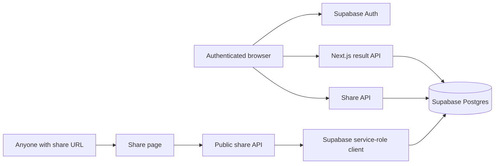

# LabVault

LabVault is a personal laboratory-results tracker built with Next.js and Supabase. Authenticated users can record numeric lab measurements, review the latest results alongside reference ranges, and create public links for sharing their results.

> **Medical data notice:** This project handles sensitive health information. It is a software project, not medical advice or a substitute for a clinician. Before using it with real data, review the database policies, authentication settings, logging, backups, retention, and compliance requirements for your environment.

## Features

- Email/password registration and login through Supabase Auth.
- Lab history grouped by specimen and category.
- Up to the three most recent measurements for each test, with dates, units, and reference ranges.
- Batch entry of several results from the same laboratory report.
- Optional healthcare-provider tracking. Providers are reused by name or created when needed.
- Public share links for a user's lab results.
- Share-link revocation through the API.
- Seed data for the lab-test catalog in `scripts/data/lab-tests.json`.

Calculated tests are intentionally excluded from manual entry. The API validates this as well as the client, so the restriction does not depend on browser behavior.

## Stack

- [Next.js](https://nextjs.org/) 16 App Router
- [Supabase](https://supabase.com/) Auth, Postgres
- [Tailwind CSS](https://tailwindcss.com/) 4
- [pnpm](https://pnpm.io/) 11.21.0

## Getting Started

### 1. Install dependencies

```bash
pnpm install
```

### 2. Configure environment variables

Create `.env.local` in the project root:

```env
NEXT_PUBLIC_SUPABASE_URL=https://your-project.supabase.co
NEXT_PUBLIC_SUPABASE_PUBLISHABLE_KEY=your-supabase-publishable-key
SUPABASE_SERVICE_ROLE_KEY=your-supabase-service-role-key
NEXT_PUBLIC_APP_URL=http://localhost:3000
```

`NEXT_PUBLIC_SUPABASE_URL` and `NEXT_PUBLIC_SUPABASE_PUBLISHABLE_KEY` are used by browser, server, and proxy clients. `SUPABASE_SERVICE_ROLE_KEY` is used only by the public-share API route and the seed script.

`NEXT_PUBLIC_APP_URL` is used by the server-rendered share page when it fetches the public share API. It must be the externally reachable base URL in deployed environments, without a trailing path.

### 3. Configure Supabase

1. Create a Supabase project.
2. Enable email/password authentication.
4. Create the tables and foreign keys listed below.
5. Add Row Level Security policies for authenticated users. The application expects users to be able to read and write their own results and manage their own share links.
6. Keep the service-role key restricted to trusted server-side code.

This repository does not currently include SQL migrations or a Supabase schema file. The application code is the source of truth for the columns it selects and writes, but database policies and constraints must be supplied by the deployment.

### 4. Seed the lab-test catalog

After the database is available and the environment variables are set:

```bash
pnpm seed
```

The seed script reads `scripts/data/lab-tests.json` and upserts rows into `lab_tests` using `name` as the conflict key. It requires `SUPABASE_SERVICE_ROLE_KEY` and is intended for trusted local or deployment tooling only.

### 5. Start the development server

```bash
pnpm dev
```

Open [http://localhost:3000](http://localhost:3000). The root route redirects unauthenticated visitors to `/login` through the Supabase session proxy.

## Database Requirements

The application expects these Supabase tables and relationships:

### `lab_tests`

Catalog entries displayed in the add-result form and result tables.

- `id`
- `name` (unique, because the seed uses `onConflict: "name"`)
- `abbreviation`
- `category`
- `specimen`
- `unit`
- `reference_range_min`
- `reference_range_max`
- `is_calculated`

### `lab_results`

Measurements entered by users.

- `id`
- `user_id`, referencing the authenticated Supabase user
- `lab_test_id`, referencing `lab_tests.id`
- `value`
- `measured_at`
- `healthcare_provider_id`, nullable and referencing `healthcare_providers.id`

### `healthcare_providers`

Optional provider names associated with results.

- `id` 
- `name`

### `lab_shares`

Share tokens owned by users.

- `id`
- `user_id`
- `token`
- `created_at`
- `expires_at`, nullable
- `revoked_at`, nullable

The public share endpoint uses the service-role client to read the token and the owner's results. It checks `revoked_at` and `expires_at` before returning data, so tokens must be unguessable and unique.

## Application Routes

| Route | Auth | Description |
| --- | --- | --- |
| `/` | Required by proxy | Minimal home page shell for the signed-in application |
| `/login` | Guest | Sign in with email and password; resend confirmation email |
| `/register` | Guest | Create an account and confirm the password |
| `/lab-results` | Required | View personal lab history and create a share link |
| `/lab-results/new` | Required | Add one or more measurements from a report |
| `/share/[token]` | Public | View results associated with a valid share token |

## API Routes

### `GET /api/lab-results`

Returns the authenticated user's results grouped by test category. Each test includes catalog metadata and the three newest measurements for that user.

### `POST /api/lab-results`

Creates one or more results. The JSON body is:

```json
{
	"measured_at": "2026-09-23",
	"healthcare_provider": "Optional provider name",
	"results": [
		{
			"lab_test_id": "test-id",
			"value": 14.2
		}
	]
}
```

The route requires an authenticated user and rejects missing fields, non-numeric values, duplicate tests in the same request, unknown tests, and calculated tests.

### `GET /api/lab-tests`

Returns the catalog entries used by the add-result form. Authentication is required.

### `POST /api/lab-shares`

Creates a share token for the authenticated user and returns its metadata. The client turns the token into `/share/[token]` and offers a copy action.

### `GET /api/lab-shares`

Returns the authenticated user's share records, newest first.

### `DELETE /api/lab-shares/[id]`

Revokes one of the authenticated user's share records by setting `revoked_at`. A revoked link returns HTTP `410` from the public endpoint.

### `GET /api/public/lab-shares/[token]`

Public endpoint used by the share page. It returns grouped results for a valid, unrevoked, non-expired token. Unknown tokens return `404`; revoked or expired tokens return `410`.

## Data Flow



The browser uses the publishable Supabase key. Server routes use the SSR client, which reads the user's auth cookies. Only the public-share route and seed script use the service-role client.

## Project Structure

```text
app/
	api/                       Route handlers for results, tests, and sharing
	components/                Shared navigation and result-table UI
	lab-results/               Result history and data-entry pages
	login/                     Login page and form
	register/                  Registration page and form
	share/[token]/             Public shared-results page
	types/                     Shared TypeScript lab-result types
	globals.css                Global CSS and Tailwind import
	layout.tsx                 Root layout, metadata, fonts, and navbar
lib/supabase/                Browser, server, proxy, and admin clients
scripts/                     Catalog seeding script and source JSON
proxy.ts                     Refreshes Supabase sessions and guards `/`
```

## Deployment Notes

- Set all four environment variables in the hosting provider.
- Set `NEXT_PUBLIC_APP_URL` to the deployed application URL so server-side share pages call the correct API origin.
- Run the seed script only from a trusted environment with access to the service-role key.
- Review Supabase Auth redirect URLs, email templates, database RLS policies and token expiration defaults.